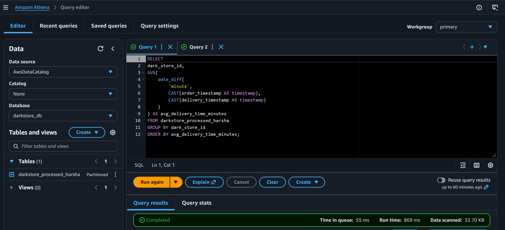

# Quick Commerce Dark Store Analytics Pipeline

This project analyzes delivery performance and stockout issues for quick commerce dark stores.

The system processes order data using an AWS serverless pipeline and visualizes insights through a dashboard.

## Architecture

S3 (Raw Orders)
↓
AWS Lambda (Data Cleaning & Transformation)
↓
S3 Processed Bucket (Parquet)
↓
AWS Glue (Data Catalog)
↓
Amazon Athena (SQL Analytics)
↓
Dashboard (React + Vite)

## Key Metrics

• Average delivery time  
• Late delivery percentage (>10 minutes)  
• Product stockout frequency  
• Orders per hour  
• Dark store performance comparison  

## Tech Stack

AWS S3  
AWS Lambda  
AWS Glue  
Amazon Athena 

React + Vite Dashboard  

## Running the Dashboard

Install dependencies:

npm install

Start the server:

npm run dev
