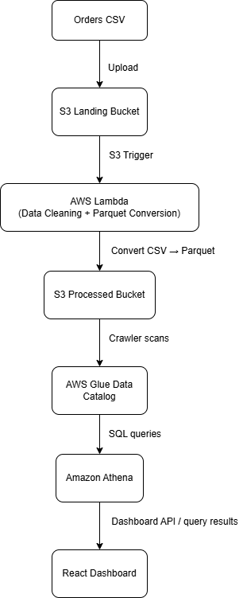
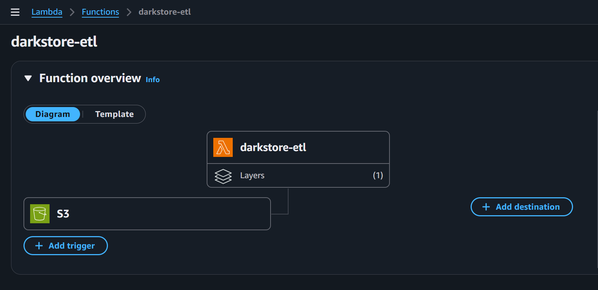
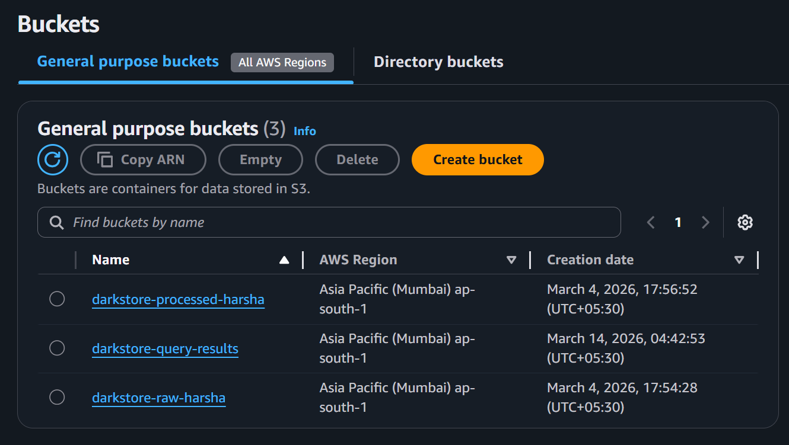

# Quick Commerce Dark Store Analytics Pipeline

This project implements a **serverless AWS data pipeline** to analyze operational performance of quick commerce **dark stores** (micro-warehouses used for fast grocery delivery).

The system ingests raw order data, processes it automatically using AWS services, and enables SQL-based analytics through Amazon Athena. The results are visualized using a React-based dashboard.

---

# Architecture

The pipeline follows a **serverless data lake architecture**:

Orders CSV
↓
Amazon S3 (Raw Landing Bucket)
↓
AWS Lambda (Data Cleaning + CSV → Parquet Conversion)
↓
Amazon S3 (Processed Data Bucket)
↓
AWS Glue Data Catalog
↓
Amazon Athena (SQL Analytics)
↓
React Dashboard



---

# AWS Infrastructure

## Lambda ETL Function

The Lambda function `darkstore-etl` is triggered when new CSV files are uploaded to the S3 raw bucket.

The function performs the following operations:

* Reads raw CSV order data from S3
* Cleans and prepares the dataset
* Converts CSV data into **Parquet format**
* Uploads the optimized dataset to the processed S3 bucket



---

## S3 Data Lake Buckets

The project uses three S3 buckets:

| Bucket                     | Purpose                         |
| -------------------------- | ------------------------------- |
| darkstore-raw-harsha       | Stores raw CSV order data       |
| darkstore-processed-harsha | Stores cleaned Parquet datasets |
| darkstore-query-results    | Stores Athena query outputs     |



---

# Athena Analytics

Amazon Athena is used to run SQL queries directly on the processed Parquet data stored in S3.

Example query used to calculate **average delivery time per dark store**:

```sql
SELECT
    dark_store_id,
    AVG(
        date_diff(
            'minute',
            CAST(order_timestamp AS timestamp),
            CAST(delivery_timestamp AS timestamp)
        )
    ) AS avg_delivery_time_minutes
FROM darkstore_processed_harsha
GROUP BY dark_store_id
ORDER BY avg_delivery_time_minutes;
```

Example Athena query execution:


Athena query outputs are automatically stored in the S3 bucket:

```
darkstore-query-results
```

---

# Key Metrics Analyzed

The pipeline enables analysis of key operational metrics for quick commerce dark stores:

* Average delivery time per dark store
* Percentage of late deliveries (>10 minutes)
* Product stockout frequency
* Orders by hour
* Dark store performance comparison

These insights help identify **delivery inefficiencies, inventory shortages, and operational bottlenecks**.

---

# Tech Stack

## Cloud & Data Engineering

* AWS S3 (Data Lake Storage)
* AWS Lambda (Serverless Data Processing)
* AWS Glue (Metadata Catalog)
* Amazon Athena (Serverless SQL Analytics)

## Frontend Visualization

* React
* Vite
* TypeScript
* Chart-based analytics dashboard

---

# Dataset

The project uses a **simulated quick commerce order dataset** representing dark store delivery operations.

Dataset schema:

* order_id
* dark_store_id
* product_category
* order_timestamp
* delivery_timestamp
* out_of_stock_flag

A small dataset sample is included in:

```
data/sample_orders.csv
```

This sample dataset demonstrates the structure used by the ETL pipeline.

---

# Repository Structure

```
quick-commerce-analytics-pipeline
│
├── architecture
│   └── architecture.png
│
├── athena_queries
│   └── delivery_analysis.sql
│
├── dashboard
│
├── lambda
│   └── data_processing.py
│
├── screenshots
│   ├── lambda_function.png
│   ├── s3_buckets.png
│   └── athena_query_result.png
│
├── data
│   └── sample_orders.csv
│
└── README.md
```

---

# Running the Dashboard

Install dependencies:

```
npm install
```

Start the development server:

```
npm run dev
```

The dashboard visualizes analytics generated from the pipeline.

---

# Project Outcome

This project demonstrates how **serverless AWS services can be combined to build a lightweight data engineering pipeline**.

The pipeline enables:

* automated data ingestion
* scalable serverless data processing
* SQL-based analytics on a data lake
* interactive dashboard visualization

It provides a practical example of an **end-to-end cloud data engineering workflow** using modern AWS services.
